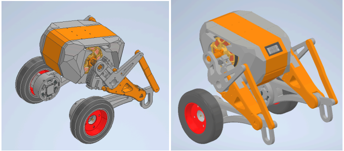
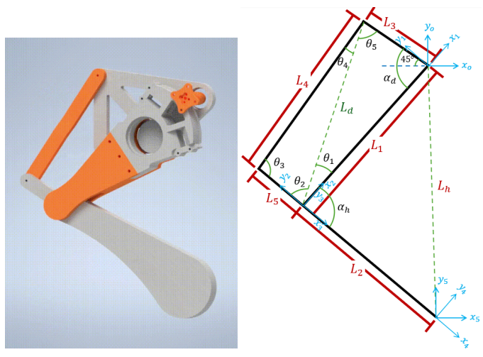
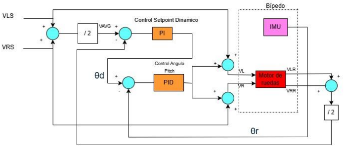
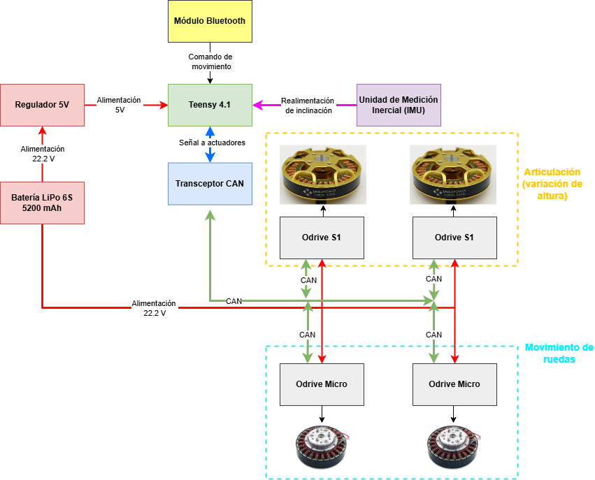
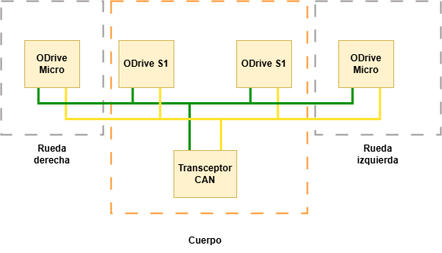
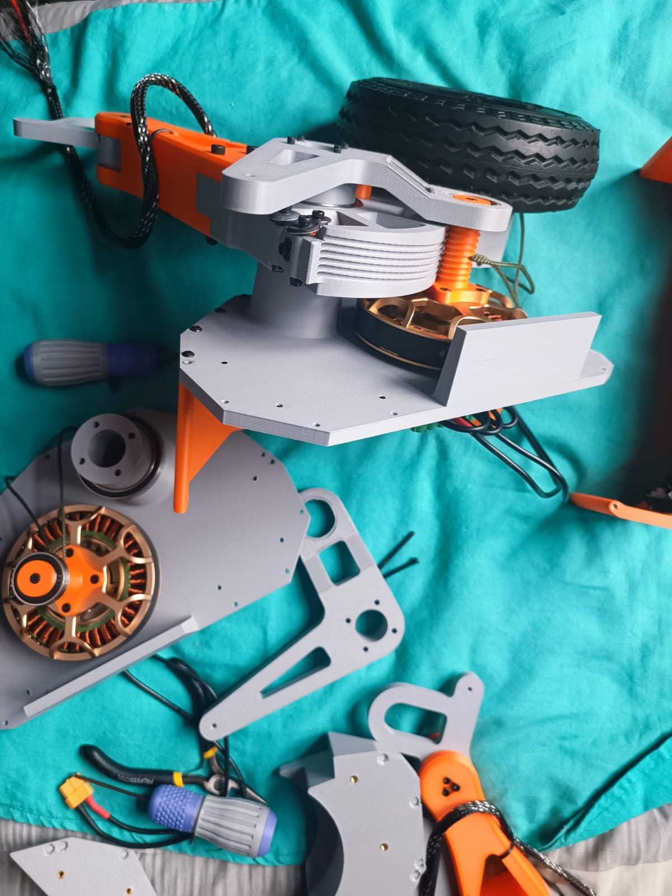
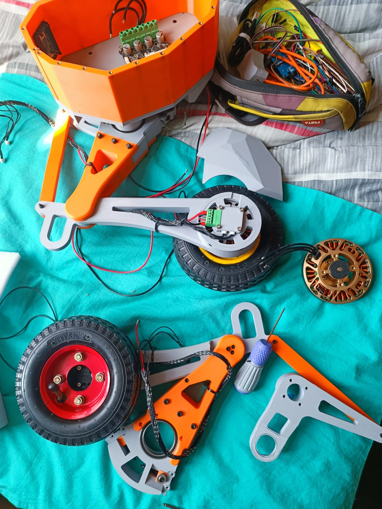
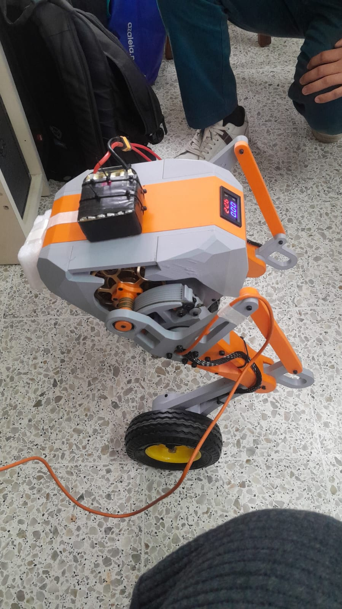
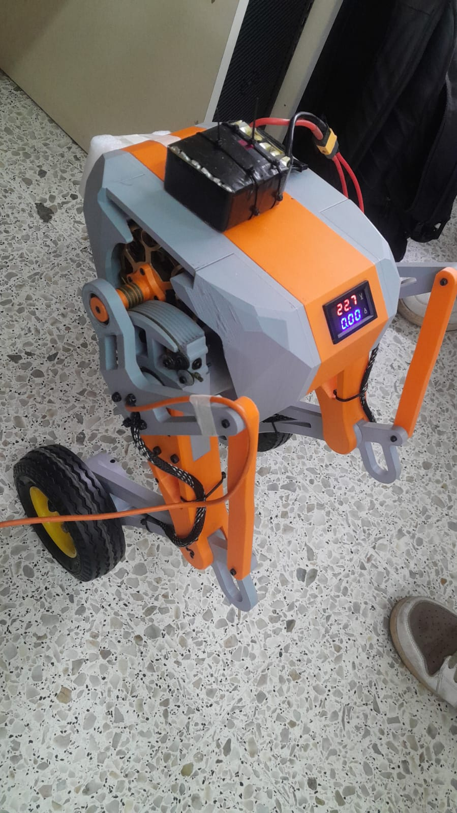
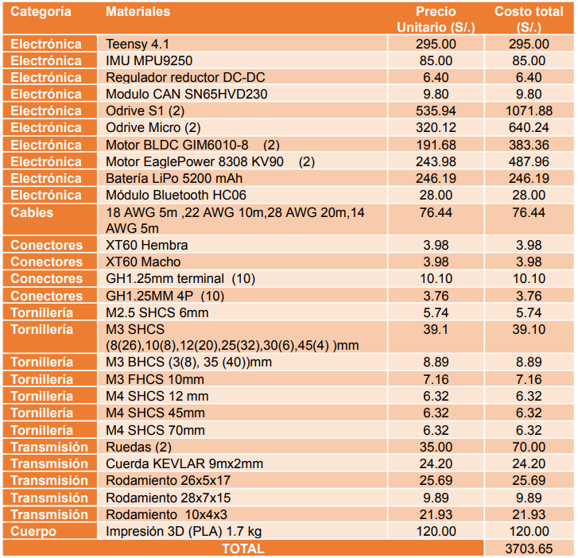

## "Cyclo" a wheeled bipedal robot

## Leg articulation mechanism - 4 bar linkage
The legs are driven using capstan drive reductor and BLDC motor

## Control loop and block diagram

## Project images
The construction
|  |  |
|-----------|-----------|
|  |  |

Some testing
|  |  |
|-----------|-----------|
|  |  |
## BOM

